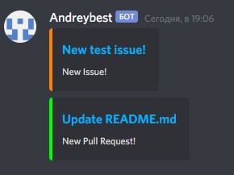

# Discord-Github PR, Issue notifier

This bot allows to send a message to selected discord text channel about new PR
or Issue on github repo.

## Instruction for running the bot

1. Create a webhook on github repo, pointing at server where the bot will be
   running + '/webhook'
2. Create a webhook on discord text channel
3. Install all dependencies from requirements.txt
4. Change all values in settings.py (DISCORD_WEBHOOK_URL can be found from
   step 2)
5. Run the bot!

## How it's made?

All in all, bot is a flask server that waits for updates from github and
structures message for sending to discord, with link and title of PR/Issue, and
with avatar and username of PR/Issue creator.

## How it looks like?

Like this:  

